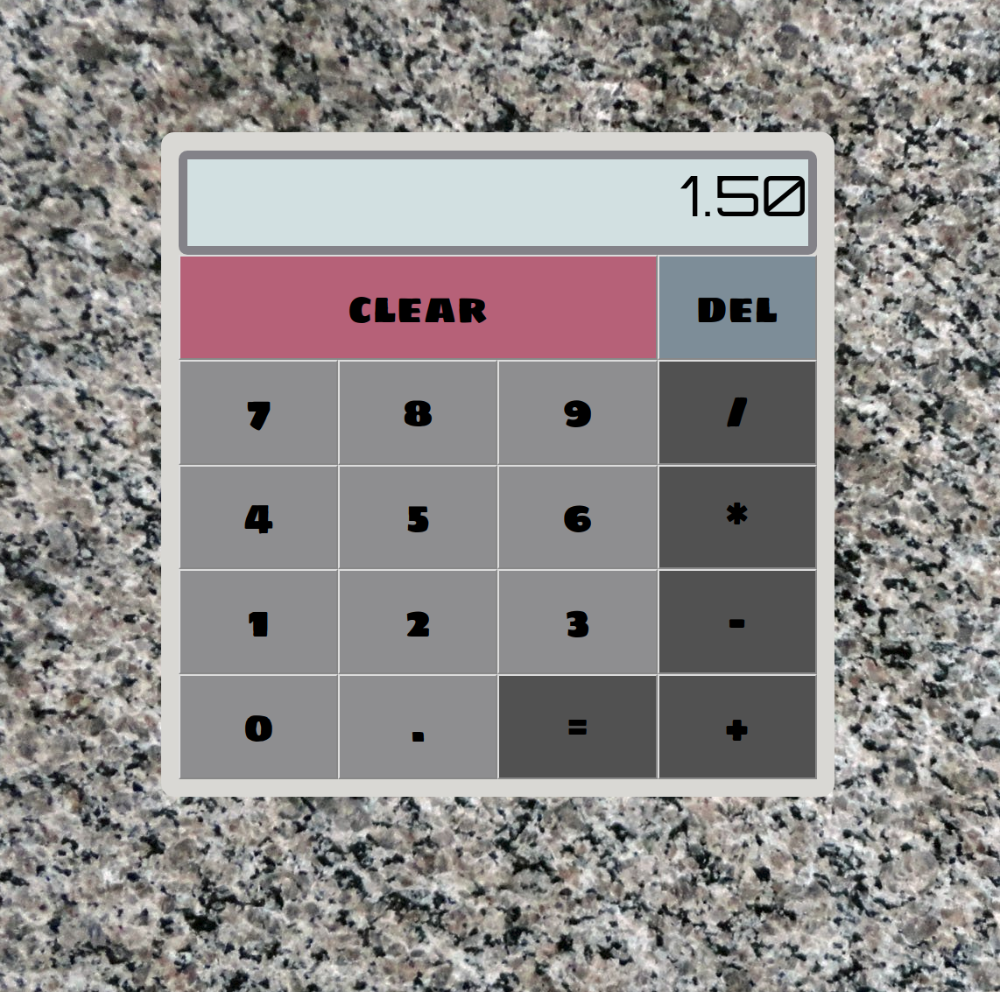

# Calculator Project

This project builds a calculator in vanilla HTML/CSS/JS with:
* Interface with Buttons/Display ✓
* Divison by Zero ✓
* Clear Button ✓
* Decimals ✓
* Adding ✓
* Subtracting ✓
* Multiplying ✓
* Dividing ✓
* Consecutive Operations ✓
* Error Handle pressing `=` early ✓
* Error Handle `5.5.5` ✓
* Rounding ✓
* Keyboard Support, including Backspace ✓
* No Screen Overflow ✓

This is a project from [The Odin Project](https://www.theodinproject.com/courses/web-development-101/lessons/calculator).

## Pre-Project Thoughts

This should be fun.
I am coming into this with a much stronger understanding of the fundamentals of javascript.
I might experiment with some fancy CSS stuff.. maybe.

## Post-Project Thoughts

This was fun.
I used CSS Grid for the first time..wowee. That is some awesomely powerful stuff.
That positioning power is excellent.
This was some good JS practice as well.
